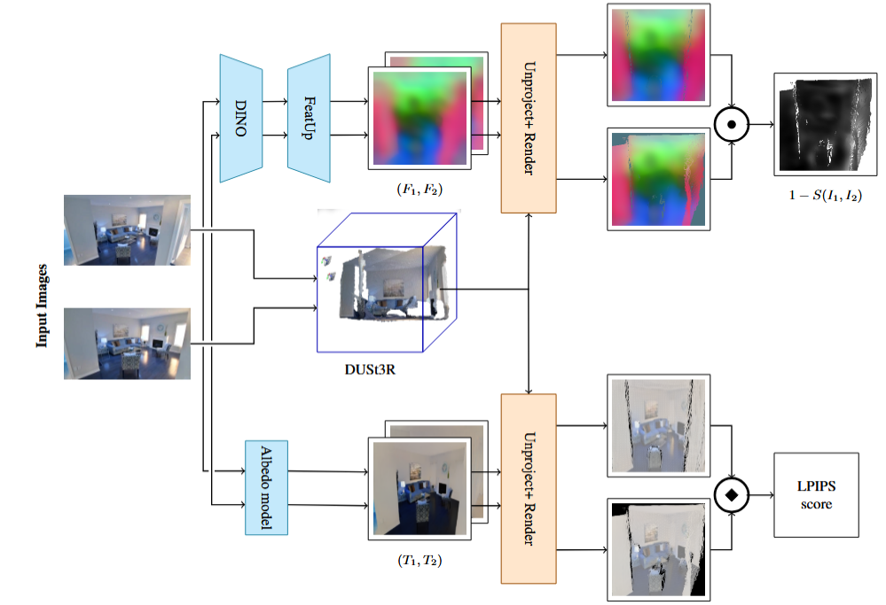

# Benchmarking Multi-View Image Generation for 3D Consistency Without Ground Truth 
Philipp Bauer, Julia Schneider


## 🔍 Method Overview 
<div align="center">
  
</div>


## Abstract
Evaluating the 3D consistency of multi-view image generation systems remains a significant challenge, especially without access to ground truth 3D data. Traditional metrics often fall short in generative settings where multiple plausible outputs can exist. In this project, we propose a novel benchmarking methodology that separately assesses geometric and texture consistency across synthesized views, without relying on ground truth. Building upon recent advances such as MEt3R and leveraging self-supervised features (e.g., DINO), our pipeline employs feature-based comparisons and view-alignment techniques to robustly quantify multi-view coherence in both geometry and appearance. We validate the method across several generative models, demonstrating its effectiveness in identifying perceptual and structural inconsistencies. This approach offers a scalable, interpretable alternative for evaluating 3D-aware image generation and paves the way for standardized benchmarking in this field.


## 📌 Dependencies

    - Python 3.10.18
    - PyTorch: 2.7.1+cu118
    - CUDA: 11.8
    - PyTorch3D: 0.7.8
    - FeatUp: 0.1.2

NOTE: Pytorch3D and FeatUp are automatically installed alongside **MEt3R**.

Tested with *CUDA 11.8*, *PyTorch 2.7.1*, *Python 3.10*


## 💡 Example Usage

Simply import and use **MEt3R** in your codebase as follows.

```python
    import torch
    from met3r import MEt3R
    from torchvision import transforms
    from PIL import Image
    
    # === Load and preprocess your images ===
    def load_and_preprocess(image_path, img_size=256):
        transform = transforms.Compose([
            transforms.Resize((img_size, img_size)),
            transforms.ToTensor(),  # Converts to [0, 1]
            transforms.Normalize(mean=[0.5, 0.5, 0.5], std=[0.5, 0.5, 0.5])  # Now in [-1, 1]
        ])
        image = Image.open(image_path).convert("RGB")
        return transform(image)
    
    # Replace with your own image paths
    img1 = load_and_preprocess("/home/schneiderju/3DCV/met3r/images_report/261961000.jpg.jpg")
    img2 = load_and_preprocess("/home/schneiderju/3DCV/met3r/images_report/263663000.jpg.jpg")
    print("Are tensors identical?", torch.equal(img1, img2))
    
    
    # Stack images: (views=2, channels, H, W)
    pair = torch.stack([img1, img2], dim=0)
    
    # Add batch dimension: (batch=1, views=2, channels, H, W)
    inputs = pair.unsqueeze(0).cuda()
    
    # === Initialize MEt3R ===
    metric = MEt3R(
        img_size=256,
        use_norm=True,
        backbone="dust3r",
        feature_backbone="dino16",
        feature_backbone_weights="mhamilton723/FeatUp",
        upsampler="featup",
        distance="cosine",
        freeze=True,
    ).cuda()
    
    import matplotlib.pyplot as plt
    
    # === Evaluate ===
    with torch.no_grad():
        score, *rest = metric(
            images=inputs,
            return_overlap_mask=False,
            return_score_map=False,
            return_score_map_rgb=True,
            return_projections=True,
            return_rgb_projections=True,
            return_predictions=True
        )
    
    
    # Should be between 0.30 - 0.35
    print(f'Geometric score: {score.mean().item()}')
    rgb_score = rest[0]
    print(f'Texture score: {rgb_score.mean().item()}')
    
    # Assuming projections is the last item returned
    projections = rest[-3]
    rgb_projections = rest[-4]
    
    projections = projections.cpu()  # move to CPU
    rgb_projections = rgb_projections.cpu()  # move to CPU
    
    
    import matplotlib.pyplot as plt
    # Assuming projections and rgb_projections are on CPU already
    # Extract first batch
    batch_proj = projections[0]  # shape: (2, 384, 256, 256)
    
    def get_rgb_img(proj_tensor):
        # proj_tensor shape: (384, 256, 256)
        rgb = proj_tensor[:3, :, :]  # take first 3 channels
        rgb = rgb.permute(1, 2, 0).numpy()  # HWC
        rgb = (rgb - rgb.min()) / (rgb.max() - rgb.min() + 1e-8)
        return rgb
    
    rgb_img_0 = get_rgb_img(batch_proj[0])
    rgb_img_1 = get_rgb_img(batch_proj[1])
    
    # For rgb_projections, check shape and convert to HWC for plotting
    # Let's assume shape is (2, 3, H, W)
    batch_rgb_proj = rgb_projections[0]  # shape (2, 3, H, W)
    
    dino_proj_img_0 = get_rgb_img(batch_rgb_proj[0])
    dino_proj_img_1 = get_rgb_img(batch_rgb_proj[1])
    
    # Plot all 4 images: projections and rgb_projections side by side
    fig, axes = plt.subplots(2, 2, figsize=(12, 12))
    
    axes[0, 0].imshow(rgb_img_0)
    axes[0, 0].set_title("Projection 0 (RGB)")
    axes[0, 0].axis('off')
    
    axes[0, 1].imshow(rgb_img_1)
    axes[0, 1].set_title("Projection 1 (RGB)")
    axes[0, 1].axis('off')
    
    axes[1, 0].imshow(dino_proj_img_0)
    axes[1, 0].set_title("Projection 0 (DINO)")
    axes[1, 0].axis('off')
    
    axes[1, 1].imshow(dino_proj_img_1)
    axes[1, 1].set_title("Projection 1 (DINO)")
    axes[1, 1].axis('off')
    
    
    
    plt.tight_layout()
    plt.show()
    
    
    def to_numpy_img(tensor):
        if hasattr(tensor, 'cpu'):
            tensor = tensor.cpu()
        img = tensor.numpy() if hasattr(tensor, 'numpy') else tensor
        if img.shape[0] == 3 or img.shape[0] == 4:  # channels first -> convert to HWC
            img = img.transpose(1, 2, 0)
        return img
    
    print(f'remdered dino features shape: {rest[-3].shape}')
    
    img1 = to_numpy_img(rest[-2].squeeze(0))
    img2 = to_numpy_img(rest[-1].squeeze(0))
    
    # Plotting
    fig, axs = plt.subplots(1, 2, figsize=(15, 5))
    
    axs[0].imshow(img1)
    axs[0].set_title('pred1')
    axs[0].axis('off')
    
    axs[1].imshow(img2)
    axs[1].set_title('pred2')
    axs[1].axis('off')
    plt.show()
    
```

